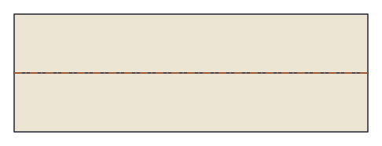
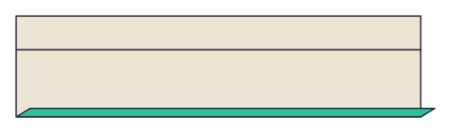
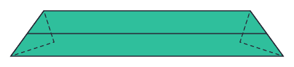

# The Keel Unit — Folding Instructions

An open-frame modular origami edge unit: fold **one unit per polyhedron
edge**. Designed for this app, in the tradition of Robert Neale's Penultimate
module and Tom Hull's PHiZZ. A printable version of this sheet is at
[`keel-unit-instructions.html`](keel-unit-instructions.html); diagrams are
generated from the app's geometric fold model by
[`tools/generate-keel-instructions.mjs`](../tools/generate-keel-instructions.mjs).

## Paper

Each unit needs a **3:1 rectangle**. Cut a square into three equal strips, or
trim strips from A4/letter. Start with paper around 9 × 3 cm or larger. If
your paper has a colored side, start with it face down — it ends up outside.

## Step 1 — Center crease

Fold the strip in half lengthwise (long edge to long edge), crease firmly,
and open it back up.

## Step 2 — Sleeve fold

Fold both long edges in to meet the center crease (a "cupboard fold"). The
slit where the flaps meet runs the length of the strip; the space under each
flap is a pocket. Together they form the **sleeve**.

## Step 3 — Miter the ends

With the flap side toward you, fold each end **behind** along a diagonal
crease from the bottom corner, climbing at **54°** to the top edge. The
folded wedges are the **tabs**. The two miters should be mirror images.

**The miter angle is the design parameter** — half the interior angle of the
polygon you want to frame:

| Miter angle | Frames    | Builds                                          |
|------------:|-----------|-------------------------------------------------|
| 54°         | pentagons | dodecahedron (30 units)                          |
| 45°         | squares   | cube (12 units)                                  |
| 30°         | triangles | tetrahedron (6), octahedron (12), icosahedron (30) |

Quick references: 45° — fold the bottom edge up along the end edge. 30° —
fold the bottom corner so the bottom edge meets the top corner. 54° — fold
the bottom edge to the center slit and steepen slightly, or make a template.

## Step 4 — The keel fold

Fold the whole strip in half lengthwise, **away from you**, right along the
sleeve slit. That mountain ridge is the **keel** — the crest of the strut.

## Assembly

Hold a unit keel-up. Slide the next unit's tab into the **open end** of the
first, between the sleeve layers, up to the miter crease. The miter makes
the joint open at exactly the polygon's corner angle. Continue tab-into-end:
five 54° units close into a pentagon frame.

Frames share struts to grow into polyhedra — each strut is one edge:

- **Tetrahedron** — 6 units, 30° (best first model)
- **Cube** — 12 units, 45°
- **Octahedron** — 12 units, 30°
- **Dodecahedron** — 30 units, 54° (the showpiece)
- **Icosahedron** — 30 units, 30°

If a joint feels loose, sharpen the keel fold and seat the tab fully; a dab
of glue inside the sleeve is fair play for display models.

> **Honesty note:** the Keel unit is an original on-screen design and hasn't
> had extensive paper testing. If a fold fights you, trust your hands over
> the diagram — and consider it an invitation to improve the design.
